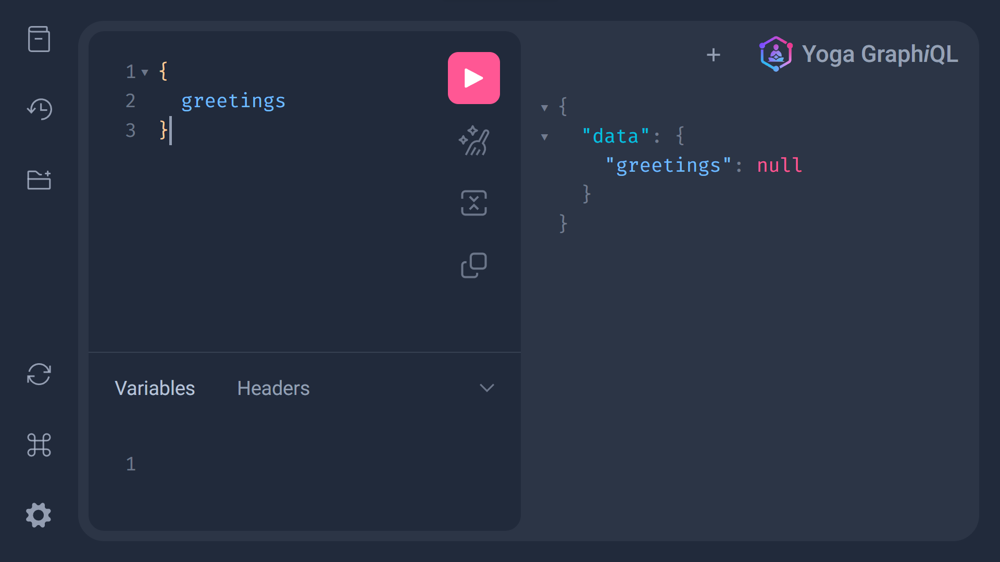

# Schema-to-GraphiQL

A project that converts a given schema to the GraphQL interface (GraphiQL)

# Note:

## Important:

This will only display the GraphiQL interface of the schema to help you generate the
schema and explore, but it will not be functional, because there are no resolvers.

# How to run:

1. Run these commands:

```bash
git clone https://github.com/OmarThinks/Schema-to-GraphiQL
cd Schema-to-GraphiQL/my-app
npm install
npm run dev
```

2. Open this link: http://localhost:3000

3. You should see a screen like this:



4. Put your schema in this file `./my-app/src/app/api/graphql/schema.graphql`

5. Re-run the project

# Technologies used:

- React
- NextJS
- GraphQL
- graphql-yoga
